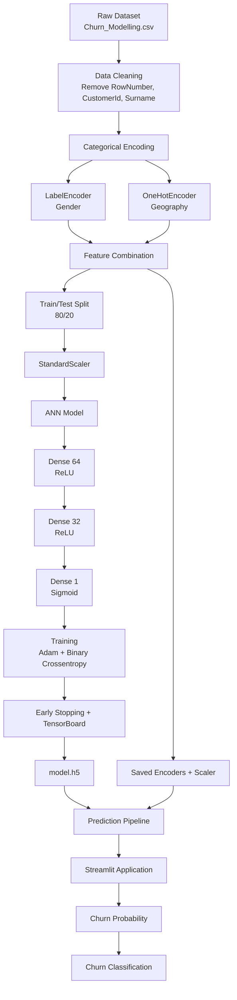

# Customer Churn Prediction — Artificial Neural Network


---

🔗 **GitHub Repository:** https://github.com/24f2006816/ANN-classification-project

---

## Project Overview

This project implements an end-to-end **Artificial Neural Network (ANN) classification workflow** for predicting customer churn.

The system takes customer demographic, financial, and account information as input and predicts whether the customer is likely to leave the bank.

The project covers the complete machine learning lifecycle:

**data preprocessing → feature encoding → feature scaling → ANN training → hyperparameter tuning → model serialization → inference → Streamlit application**

The classification target is the `Exited` column from the Churn Modelling dataset.

### What makes this more than a basic neural-network notebook

* Categorical features are handled using dedicated encoders and the fitted preprocessing objects are serialized for inference.
* Numerical features are standardized using `StandardScaler`.
* The ANN uses multiple dense layers with ReLU activation and a sigmoid output for binary classification.
* **Early Stopping** is used to restore the best model weights based on validation loss.
* **TensorBoard** is configured to monitor training.
* A separate hyperparameter-tuning workflow uses `GridSearchCV` with `SciKeras`.
* The trained model and preprocessing artifacts are reused by the prediction pipeline.
* A **Streamlit application** provides an interactive interface for real-time churn prediction.

---

## Key Features

* **End-to-end ANN classification pipeline** — preprocessing, training, evaluation, serialization, and inference
* **Categorical encoding** — `LabelEncoder` for gender and `OneHotEncoder` for geography
* **Feature scaling** — `StandardScaler` fitted on the training data and reused during prediction
* **ANN architecture** — dense neural network with ReLU hidden layers and sigmoid binary-classification output
* **Early stopping** — prevents unnecessary training and restores the best validation weights
* **TensorBoard integration** — training visualization and monitoring
* **Hyperparameter tuning** — grid search over neurons, hidden layers, and epochs
* **Serialized preprocessing artifacts** — encoders and scaler are saved as `.pkl` files
* **Saved Keras model** — trained model stored as `model.h5`
* **Streamlit inference application** — interactive customer churn prediction
* **Prediction probability** — application displays the model's churn probability before the final classification

---

## Machine Learning Workflow



### Stage-by-Stage Summary

| Stage                  | What happens                                                                            |
| ---------------------- | --------------------------------------------------------------------------------------- |
| **Raw Data**           | `Churn_Modelling.csv` contains customer demographic, financial, and account information |
| **Data Cleaning**      | `RowNumber`, `CustomerId`, and `Surname` are removed as irrelevant features             |
| **Gender Encoding**    | `LabelEncoder` converts gender categories into numerical values                         |
| **Geography Encoding** | `OneHotEncoder` converts geographical categories into numerical features                |
| **Feature Split**      | `Exited` is separated as the classification target                                      |
| **Train/Test Split**   | Dataset is divided using an 80/20 split with `random_state=42`                          |
| **Feature Scaling**    | `StandardScaler` is fitted on training data and applied to test data                    |
| **ANN Training**       | Dense neural network is trained using Adam and binary crossentropy                      |
| **Training Control**   | Early stopping monitors validation loss and restores the best weights                   |
| **Monitoring**         | TensorBoard records training information                                                |
| **Serialization**      | Model, encoders, and scaler are saved for later inference                               |
| **Prediction**         | New customer information is encoded, scaled, and passed to the trained ANN              |
| **Application**        | Streamlit provides an interactive interface for customer churn prediction               |

---

## Model Architecture

The primary ANN model is implemented using TensorFlow/Keras:

```text
Input Features
      │
      ▼
Dense Layer
64 Neurons
ReLU
      │
      ▼
Dense Layer
32 Neurons
ReLU
      │
      ▼
Output Layer
1 Neuron
Sigmoid
      │
      ▼
Churn Probability
```

### Configuration

| Component      | Configuration                   |
| -------------- | ------------------------------- |
| Framework      | TensorFlow / Keras              |
| Architecture   | Sequential                      |
| Hidden Layer 1 | 64 neurons, ReLU                |
| Hidden Layer 2 | 32 neurons, ReLU                |
| Output Layer   | 1 neuron, Sigmoid               |
| Optimizer      | Adam                            |
| Learning Rate  | `0.01`                          |
| Loss           | Binary Crossentropy             |
| Metric         | Accuracy                        |
| Maximum Epochs | 100                             |
| Early Stopping | Patience = 10                   |
| Validation     | Test split used during training |

---

## Hyperparameter Tuning

The project includes a dedicated hyperparameter-tuning notebook:

```text
hyperparametertuningann.ipynb
```

The tuning workflow uses **SciKeras**, `KerasClassifier`, and `GridSearchCV`.

The following parameters are explored:

| Parameter        | Values          |
| ---------------- | --------------- |
| Neurons          | 16, 32, 64, 128 |
| Hidden Layers    | 1, 2            |
| Epochs           | 50, 100         |
| Cross Validation | 3-fold          |

The tuning process searches for a suitable ANN configuration based on cross-validation performance.

---

## Input Features

The model uses the following customer attributes:

| Feature           | Type        | Description                              |
| ----------------- | ----------- | ---------------------------------------- |
| `CreditScore`     | Numeric     | Customer credit score                    |
| `Geography`       | Categorical | Customer geography                       |
| `Gender`          | Categorical | Customer gender                          |
| `Age`             | Numeric     | Customer age                             |
| `Tenure`          | Numeric     | Number of years with the bank            |
| `Balance`         | Numeric     | Customer account balance                 |
| `NumOfProducts`   | Numeric     | Number of bank products used             |
| `HasCrCard`       | Binary      | Whether the customer has a credit card   |
| `IsActiveMember`  | Binary      | Whether the customer is an active member |
| `EstimatedSalary` | Numeric     | Estimated customer salary                |

### Target

```text
Exited
```

```text
0 → Customer is not predicted to churn
1 → Customer is predicted to churn
```

The application uses a probability threshold of `0.5` for the final classification.

---

## Data Preprocessing

The preprocessing pipeline removes irrelevant identifiers:

```text
RowNumber
CustomerId
Surname
```

### Gender

Gender is transformed using:

```python
LabelEncoder()
```

### Geography

Geography is transformed using:

```python
OneHotEncoder()
```

This creates numerical columns for the geographical categories.

### Feature Scaling

Numerical model inputs are standardized using:

```python
StandardScaler()
```

The fitted preprocessing objects are saved separately:

```text
label_encoder_gender.pkl
onehot_encoder_geo.pkl
scaler.pkl
```

This allows the same transformations to be applied when making predictions on new customer data.

---

## Project Architecture

```text
ANN-classification-project/
│
├── Churn_Modelling.csv
│
├── experiments.ipynb
│   └── Data preprocessing + ANN training + TensorBoard
│
├── hyperparametertuningann.ipynb
│   └── ANN hyperparameter tuning with GridSearchCV
│
├── prediction.ipynb
│   └── Model loading + preprocessing + prediction
│
├── salaryregression.ipynb
│   └── Additional ANN regression experiment
│
├── app.py
│   └── Streamlit prediction application
│
├── model.h5
│   └── Trained ANN classification model
│
├── scaler.pkl
│   └── Fitted StandardScaler
│
├── label_encoder_gender.pkl
│   └── Fitted gender LabelEncoder
│
├── onehot_encoder_geo.pkl
│   └── Fitted geography OneHotEncoder
│
└── requirements.txt
    └── Python dependencies
```

---

## Tech Stack

| Layer                      | Technology              |
| -------------------------- | ----------------------- |
| Language                   | Python                  |
| Deep Learning              | TensorFlow / Keras      |
| Machine Learning           | scikit-learn            |
| Hyperparameter Tuning      | SciKeras + GridSearchCV |
| Data Processing            | Pandas, NumPy           |
| Visualization / Monitoring | TensorBoard, Matplotlib |
| Web Application            | Streamlit               |
| Model Serialization        | HDF5 + Pickle           |
| Development                | Jupyter Notebook        |

---

## Repository Components

### `experiments.ipynb`

Contains the primary machine learning workflow:

* Dataset loading
* Data cleaning
* Gender encoding
* Geography one-hot encoding
* Train/test split
* Feature scaling
* ANN construction
* Model training
* Early stopping
* TensorBoard monitoring
* Model serialization

### `hyperparametertuningann.ipynb`

Contains the hyperparameter search workflow using:

```text
SciKeras
    +
KerasClassifier
    +
GridSearchCV
```

### `prediction.ipynb`

Demonstrates the complete inference workflow:

```text
Raw Customer Input
       ↓
Gender Encoding
       ↓
Geography Encoding
       ↓
Feature Scaling
       ↓
ANN Model
       ↓
Churn Probability
       ↓
Classification
```

### `app.py`

Provides the interactive Streamlit interface for entering customer information and obtaining a churn prediction.

---

## Local Setup

**Prerequisites:** Python 3.x and `pip`

```bash
# 1. Clone the repository
git clone https://github.com/24f2006816/ANN-classification-project.git
cd ANN-classification-project

# 2. Create a virtual environment
python -m venv venv

# 3. Activate the environment
source venv/bin/activate
# Windows: venv\Scripts\activate

# 4. Install dependencies
pip install -r requirements.txt

# 5. Run the Streamlit application
streamlit run app.py
```

Open the Streamlit URL displayed in the terminal.

---

## Running the Notebooks

Start Jupyter:

```bash
jupyter notebook
```

Then run:

```text
experiments.ipynb
hyperparametertuningann.ipynb
prediction.ipynb
```

The notebooks are intended to demonstrate the individual stages of the machine learning workflow.

---

## Streamlit Application

The application provides interactive inputs for:

* Geography
* Gender
* Age
* Balance
* Credit Score
* Estimated Salary
* Tenure
* Number of Products
* Credit Card ownership
* Active membership

The application then:

1. Encodes categorical inputs.
2. Combines the encoded features.
3. Applies the saved scaler.
4. Loads the trained ANN.
5. Generates a churn probability.
6. Classifies the customer using a `0.5` probability threshold.

---

## Model Artifacts

| Artifact                   | Purpose                      |
| -------------------------- | ---------------------------- |
| `model.h5`                 | Trained TensorFlow/Keras ANN |
| `scaler.pkl`               | Fitted `StandardScaler`      |
| `label_encoder_gender.pkl` | Fitted gender encoder        |
| `onehot_encoder_geo.pkl`   | Fitted geography encoder     |

Keeping these artifacts together allows the Streamlit application to perform inference without retraining the model.

---

## Project Structure Rationale

| Decision                   | Reason                                                                             |
| -------------------------- | ---------------------------------------------------------------------------------- |
| Separate encoder artifacts | Allows inference to reproduce the categorical transformations used during training |
| Separate scaler artifact   | Ensures new inputs are transformed using the fitted training scaler                |
| `model.h5`                 | Stores the trained ANN for direct inference                                        |
| Early Stopping             | Restores the best model weights based on validation loss                           |
| TensorBoard                | Provides visibility into model training                                            |
| Hyperparameter notebook    | Separates experimentation from the primary training workflow                       |
| Streamlit application      | Provides an interactive interface over the trained model                           |

---

## Learning Outcomes

This project demonstrates practical implementation of:

* Artificial Neural Networks
* Binary classification
* TensorFlow/Keras
* Feature engineering
* Label encoding
* One-hot encoding
* Feature standardization
* Hyperparameter tuning
* Cross-validation
* Early stopping
* TensorBoard
* Model serialization
* Model inference
* Streamlit application development

---

## Future Improvements

* Add model performance metrics and confusion matrix
* Add ROC-AUC evaluation
* Add SHAP-based model explainability
* Add experiment tracking with MLflow
* Improve class-imbalance handling
* Add automated model retraining
* Containerize the application using Docker
* Deploy the Streamlit application to a cloud platform
* Add CI/CD for automated testing and deployment

---

## Repository

**GitHub:** https://github.com/24f2006816/ANN-classification-project

**Author:** Pratyaksh Pandey
**Program:** B.Sc. Data Science & Applications, IIT Madras

---

*Built to demonstrate an end-to-end deep learning workflow — from raw customer data through ANN training, hyperparameter experimentation, serialized inference, and an interactive prediction application.*
